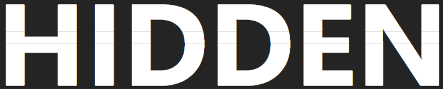

<a name="readme-top"></a>

<!--
[![Contributors][contributors-shield]][contributors-url]
[![Forks][forks-shield]][forks-url]
[![Stargazers][stars-shield]][stars-url]
[![Issues][issues-shield]][issues-url]
[![MIT License][license-shield]][license-url]
[![LinkedIn][linkedin-shield]][linkedin-url] -->

<!-- PROJECT LOGO -->

<br />
<div align="center">
  <a href="https://github.com/originalsidd/hidden-web">
    
  </a>

  <h3 align="center">HIDDEN</h3>

  <p align="center">
    Human Interface Device Differently-abled Empowering Nexus
    <br />
    <a href="https://github.com/originalsidd/hidden-web"><strong>MAKEATHON
TEAM ORANGE</strong></a>
    <br />
  </p>
</div>

<!-- TABLE OF CONTENTS -->
<details>
  <summary>Table of Contents</summary>
  <ol>
    <li>
      <a href="#about-the-project">About The Project</a>
      <ul>
        <li><a href="#built-with">Built With</a></li>
      </ul>
    </li>
    <li>
      <a href="#getting-started">Getting Started</a>
      <ul>
        <li><a href="#prerequisites">Prerequisites</a></li>
        <li><a href="#installation">Installation</a></li>
      </ul>
    </li>
    <li><a href="#roadmap">Roadmap</a></li>
  </ol>
</details>

<!-- ABOUT THE PROJECT -->

## About The Project

[![Product Name Screen Shot][product-screenshot]

AI-powered Assistive technology to help people with disabilities

Chirag Madaan - 20BCI0059

Siddharth Pal - 20BDS0409

Our project provides people with disabilities that affect their fine motor skills or make it difficult to use a traditional keyboard or mouse, with an alternative input method that is much easier and more comfortable to use.

Using our project, physically challenged people will be able to control their laptops, computers and mobile devices using their voice.

We provide this functionality by making our microcontroller act as an HID to mimic keyboard and mouse.

### Built With

This section should list any major frameworks/libraries used to bootstrap your project. Leave any add-ons/plugins for the acknowledgements section. Here are a few examples.

-   [![React][react.js]][react-url]
-   ![image][vite-url]
-   ![image][python-url]

<p align="right">(<a href="#readme-top">back to top</a>)</p>

<!-- GETTING STARTED -->

## Getting Started

To get a local copy of the project, follow the steps.

### Prerequisites

-   yarn
    ```sh
    yarn
    yarn run dev
    ```

### Installation

1. Clone the repo
    ```sh
    git clone https://github.com/originalsidd/hidden-web.git
    ```
2. Install yarn packages
    ```sh
    yarn
    ```
3. Setup Python server in ESP32 module

<p align="right">(<a href="#readme-top">back to top</a>)</p>

<!-- USAGE EXAMPLES -->

## Usage

Users will get to perform several voice commands. Example of few of them are given as follows:

<p align="right">(<a href="#readme-top">back to top</a>)</p>

<!-- ROADMAP -->

## Roadmap

-   [x] Add Vite to React Frontend
-   [x] Add Updated Firmware to ESP32
-   [x] Add Updated Firmware to Raspberry Pico
-   [x] Add Speech Recognition Module
-   [x] Add Voice Recorder Handling

See the [open issues](https://github.com/othneildrew/Best-README-Template/issues) for a full list of proposed features (and known issues).

<p align="right">(<a href="#readme-top">back to top</a>)</p>

<!-- CONTRIBUTING -->

## Contributing

Contributions are what make the open source community such an amazing place to learn, inspire, and create. Any contributions you make are **greatly appreciated**.

If you have a suggestion that would make this better, please fork the repo and create a pull request. You can also simply open an issue with the tag "enhancement".
Don't forget to give the project a star! Thanks again!

1. Fork the Project
2. Create your Feature Branch (`git checkout -b feature/AmazingFeature`)
3. Commit your Changes (`git commit -m 'Add some AmazingFeature'`)
4. Push to the Branch (`git push origin feature/AmazingFeature`)
5. Open a Pull Request

<p align="right">(<a href="#readme-top">back to top</a>)</p>

<!-- LICENSE -->

## Contact

Project Link: [https://github.com/originalsidd/hidden-web](https://github.com/originalsidd/hidden-web)

<p align="right">(<a href="#readme-top">back to top</a>)</p>

<!-- ACKNOWLEDGMENTS -->

## Acknowledgments

<p align="right">(<a href="#readme-top">back to top</a>)</p>

<!-- MARKDOWN LINKS & IMAGES -->
<!-- https://www.markdownguide.org/basic-syntax/#reference-style-links -->

[product-screenshot]: public/pic.png
[next.js]: https://img.shields.io/badge/next.js-000000?style=for-the-badge&logo=nextdotjs&logoColor=white
[next-url]: https://nextjs.org/
[react.js]: https://img.shields.io/badge/React-20232A?style=for-the-badge&logo=react&logoColor=61DAFB
[react-url]: https://reactjs.org/
[vite-url]: https://img.shields.io/badge/Vite-B73BFE?style=for-the-badge&logo=vite&logoColor=FFD62E
[bootstrap-url]: https://getbootstrap.com
[python-url]: https://img.shields.io/badge/Python-FFD43B?style=for-the-badge&logo=python&logoColor=blue
